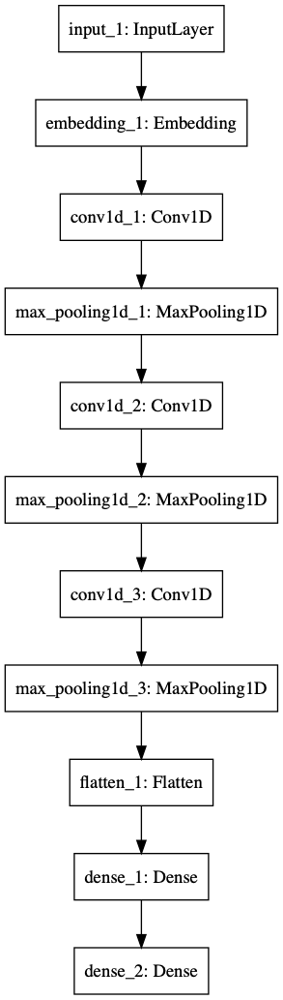
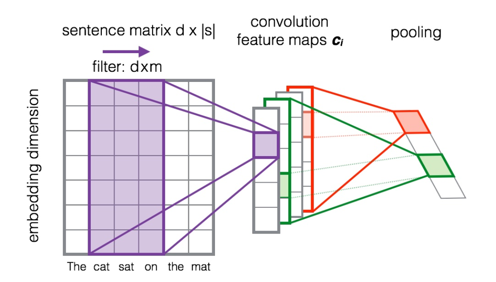
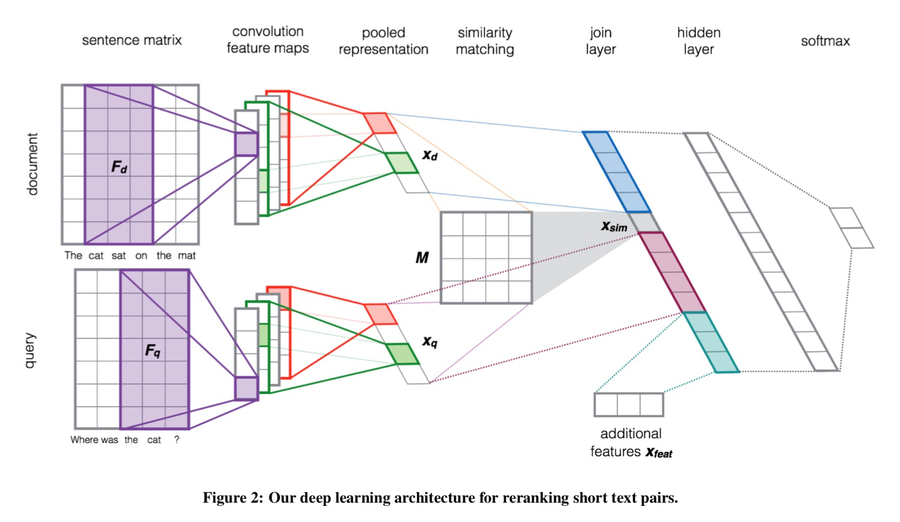
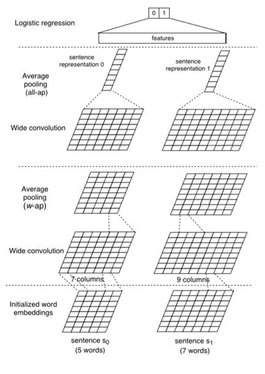
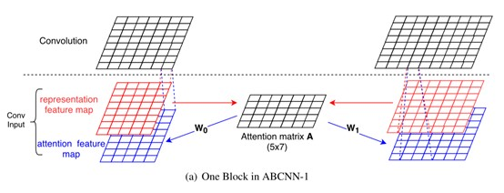
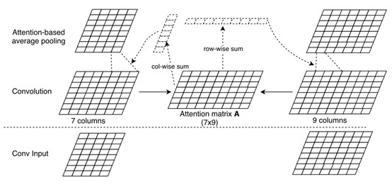
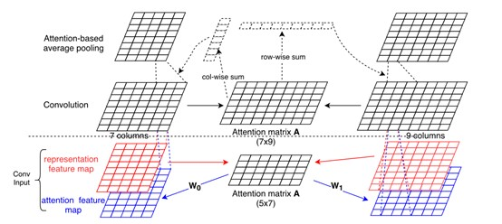
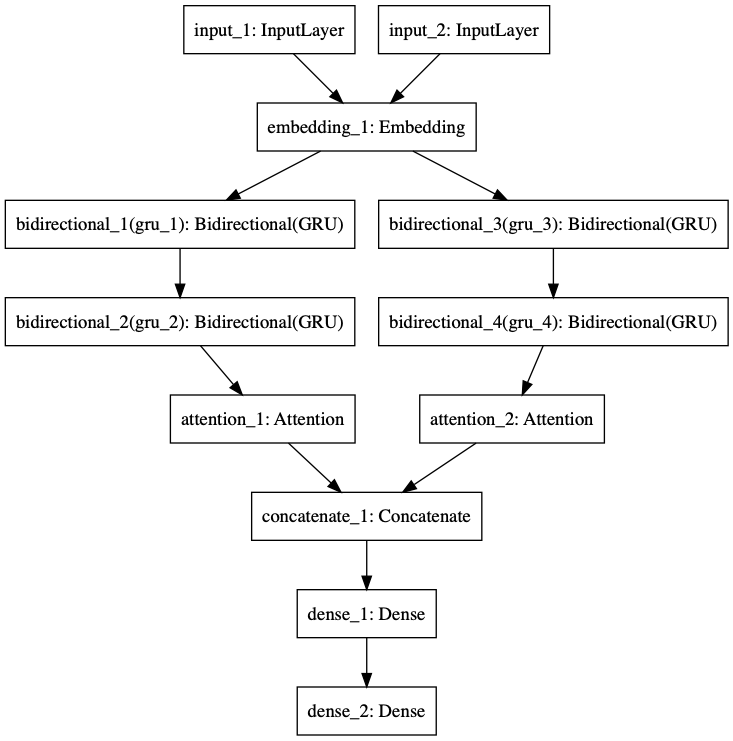
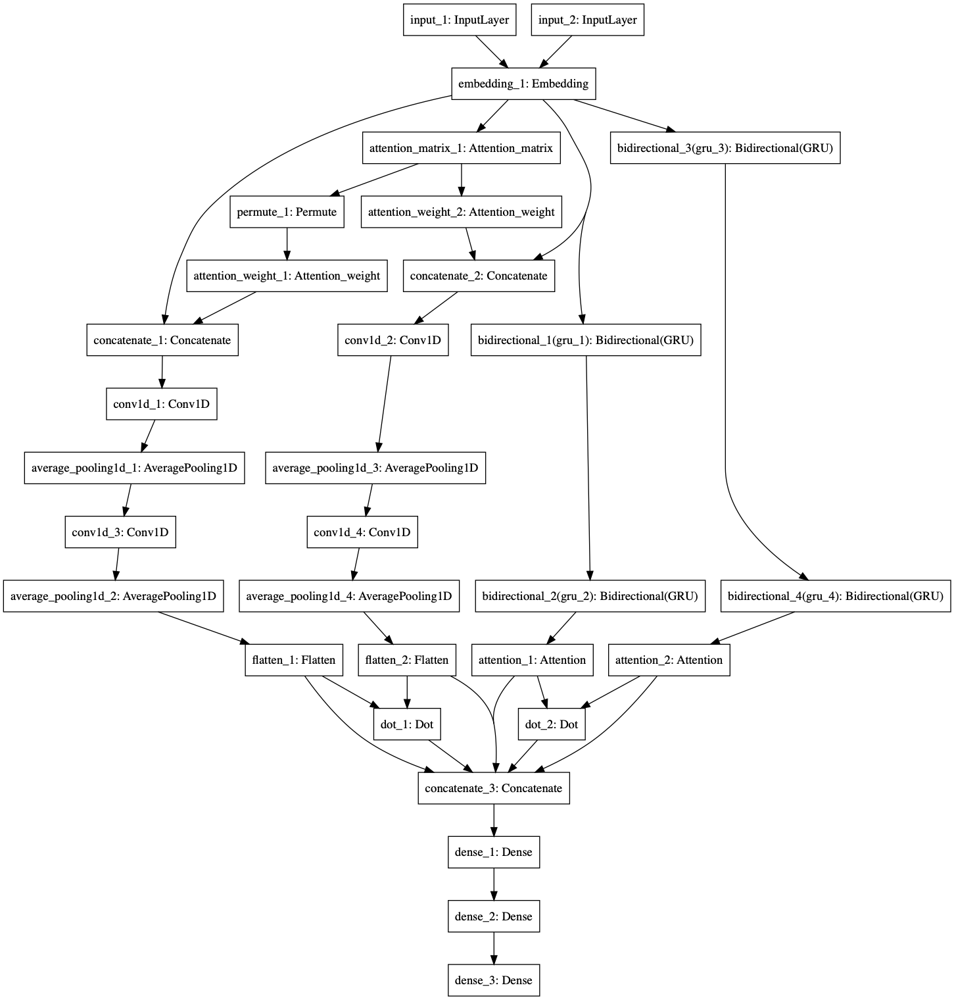

# Document-Based-Question-Answering-System

## 任务

基于文档的问答，针对问题从给定文档中选择包含答案的句子。该任务需要建立一个模型，其可以从问题的给定文档句子判定是否可能为答案。

### 训练/验证数据

Training set: 264416 samples

Validataion set: 39997 samples

Training/Validation data format:

```
俄罗斯贝加尔湖的面积有多大?\t 贝加尔湖，中国古代称为北海，位于俄罗斯西伯利亚的南部。\t 0 
俄罗斯贝加尔湖的面积有多大?\t 贝加尔湖是世界上最深，容量最大的淡水湖。\t 0 
俄罗斯贝加尔湖的面积有多大?\t 贝加尔湖贝加尔湖是世界上最深和蓄水量最大的淡水湖。\t 0 
俄罗斯贝加尔湖的面积有多大?\t 它位于布里亚特共和国(Buryatiya) 和伊尔库茨克州(Irkutsk) 境内。\t 0 
俄罗斯贝加尔湖的面积有多大?\t 湖型狭长弯曲，宛如一弯新月，所以又有“月亮湖”之称。\t 0 
俄罗斯贝加尔湖的面积有多大?\t 湖长636公里，平均宽48公里，最宽79.4公里，面积3.15万平方公里。\t 1 
俄罗斯贝加尔湖的面积有多大?\t 贝加尔湖湖水澄澈清冽，且稳定透明(透明度达40.8米)，为世界第二。\t 0
```

### 输出

结果中的每一行应为该文档中对应句子可能是问题答案的几率，该几率介于[0,1]之间。

### 评测

1. Mean Average Precision
2. Mean Reciprocal Rank

### 编译运行环境

Python 3.6

Keras 2.2.4

TensorFlow 1.12.0

## 系统架构

### 生成训练集

#### 词向量训练

从[Wikipedia. org](https://zh.wikipedia.org/wiki/Wikipedia:首页)上下载所有的中文条目，使用jieba包进行分词。之后再调用gensim的Word2Vec进行词向量训练，词向量大小设置为300维。

为了验证利用中文Wiki进行训练的优势，我们之后又在数据文本上进行词向量训练，发现使用中文Wiki的MRR会高3%左右。

#### 数据预处理
对于原始中文文档，使用jieba包进行分词，同时忽略所有的标点符号。

利用之前训练得到的词向量，构建针对于训练文本的词向量层。具体的做法为训练文本中出现的所有单词分配一个id，同时查找该单词对应的词向量，存入一个新的矩阵。这个矩阵就是之后构建的词向量层，每个单词的id就是在这个单词在词向量层中对应的词向量的索引。

#### 训练集生成

根据数据预处理中得到的词向量矩阵，为每一个单词分配的id，将原始文档中的所有单词转化成对应的id。

为每一个句子设置阶段长度为200，统一大小从而方便之后的训练。

利用numpy，分别将经过上述处理的问题 *Query* 和文档 *Document* 每个句子的id序列存入.npy文件，完成训练集和测试集的生成。

### 训练模型

利用以TensorFlow作为后端的Keras生成网络模型。模型输入为问题和文档的句子id序列`[X_train_Q, X_train_A]`，经过词嵌入层 *Embedding* 的处理之后，转化为300维的词向量。

### 评测模型

因为提供的评测工具只能在windows上运行，为了方便在Mac以及Linux环境下的使用，我们在[inference.py](./code/inference.py)中实现了对mrr的评测，可以用来方便的评估模型的好坏。

## 网络模型

我们分别复现了3篇论文中的模型，并且加上了一些自己的修改。

### NaÏve CNN

这个模型只是简单的一维卷积CNN网络，目的在于验证我们的词向量以及提供一个基础的baseline。



### CNN(RSTP)

这个模型结构参考的是Learning to rank short text pairs with convolutional deep neural networks。首先使用一个典型的CNN结构对整个句子的词向量矩阵进行处理，首先使用宽度为m的窗口进行一维宽卷积，进行宽卷积能够让句子首尾的词被访问的频率增加。然后将卷积之后的feature map池化为一维向量。



本模型使用上述的CNN结构对问题和文档进行相同的处理，得到两个向量$x_d,x_q$。然后计算这两个向量的相似度$x_{sim} = x_d^TMx_q$，M是一个由网络学习得到的参数矩阵。将$x_d,x_{sim},x_q$与额外的特征合并为一个向量作为最后全连接层的输入。



我们认为这个简单粗暴的模型有效的原因是：它没有直接计算query和document之间的余弦距离，而是多用了一个参数矩阵M。这种计算相似度的方式可以看作是将$x_d$映射成为$x_d^T=Mx_d$，再让$x_d,x_q$之间计算相似度。

后来的一些模型也借鉴了这个经典的结构

一种可能的改进是：对于query和document建模是分开的，但现在很多模型采用共享结构的方式，因为共享之后，可以更好地模拟出query与document之间的一些共有特征，效果可能会更好一些。

### ABCNN

这个模型结构的想法来自于《ABCNN: Attention-based convolutional neural network for modeling sentence pairs》这篇论文，其核心思想是在已有的句对训练网络中加入注意力矩阵，即Attention的概念。在过去的工作中，对每个句子的表示是独立的，问题和回答的表示过程互不影响，在中间的卷积计算中也并不相关。在这些模型里任意一个短语的特征与其位置和在另一个句子中对应关系的信息无关。于是，对于一个长句来说，句子中不论是否重要的部分都被以相同的重要性看待。而且句中部分与对应句子的相关性也没有影响卷积的输入和输出过程。

对这种问题，Attention机制提供了一种较好的方案，使得句子的表示更加依赖于相对应的另一个句子。ABCNN就是基于这种Attention的思路，改造了已有的CNN网络。

ABCNN的基础是BCNN，它的结构类似于之前的RSTP，是两个句子分开进行处理，最后进行合并的。区别在于ABCNN有两个卷积、池化的过程，且最后通过平均池化将整句缩小到一个词向量长度。这两个最终表示被拼接起来送入一个logistic回归中来得到结果。在我们的BCNN设计中，借鉴了RSTP的结构引入了最后的输入$x_{sim}$一并传入回归，回归使用了两个全连接层。这个基本框架的表现与RSTP比较接近。



我们首先的工作是在BCNN的第一个卷积层之前加入Attention层。Attention层可以通过对问题和回答表示的每个短语进行相关性比较得到，这个矩阵的长和宽分别是问题和回答句子的长度。事实上，这个矩阵中每个位置都表示了两个句子中各一个短语间的关系，它的值可以根据两个输入直接计算得出。

我们要训练的是这个矩阵对应到下一层卷积输入的权值。这需要我们自行设计一个网络层，通过这个网络层的权与注意力矩阵A相乘，最终得到一个大小和输入句子相同的多维向量，这相当于是句子的另一个特征。Attention矩阵乘上这样的权值，得到的大小和输入是相同的，所以我们把两个Attention分别于对应的输入叠加，送到下一个卷积层中去。这一次的输入就考虑到了短语和另一个句子的相关性，具有了注意力的特点。这个模型的表现比之前的BCNN有很大提升，可以验证注意力机制确实非常有效。



考虑到注意力不仅能加到输入中，其实也可以影响卷积的输出，我们把卷积得到的结果，按照和另一个句子结果的相关性重新做一个加权。这种想法也十分直观：如果某一个特征和另一个句子关系不大，那它当然很不可能是另一个句子的答案了。所以，我们用卷积得到的结果再次求取一个Attention矩阵，这次利用所得到的Attention矩阵来进行自定义池化。结果等同于池化后句子中的每个短语表示都是被注意力根据其重要性加权过的。



将两种思路结合起来，并且将网络进行堆叠，我们得到了ABCNN的最终版本。



但是最终版本的表现并不如只在输入增加注意力的版本性能好。

综合起来分析，注意力的应用大幅提升了网络的效果，这主要是因为加入注意力后在特征提取的过程中有一定的取舍和重点。如果我们给有用的信息更大的权重，得到的结果就可能更加准确。

不过这个模型效果最好的是只实现输入增加注意力。我们认为当两边都增加注意力时，表现反而下降的原因是过分强调了句间关联和短语位置。当我们求取句间关联矩阵A的效果不佳或不完善时，就很可能对系统引入虚假信息，造成负面影响。但是基于注意力对网络进一步改进是很有前景的。

### RNN with Attention

在CNN之外，我们还尝试使用了rnn相关的网络结构。初始，我们考虑将这个任务看作与上一个任务相似的语义连贯问题，采用上次作业使用的Hierarchical attention networks for document classification中的结构进行尝试，但是效果并没有想象中的好。我们分析认为是虽然正确答案一定与问题相连贯，但其他错误答案描述的也是与问题中相关的概念，依然有较强的相关性，直接作为语义连贯问题并不能很好的进行区分。因此，我们随后继续采用将问题与答案分开处理，同样使用attention结构来处理这个问题。但是这种方法感觉对两边的关键词匹配还是有所缺乏，导致效果不如ABCNN好。



### Merge Model

正如我们之前所分析的那样，在这个问答系统的任务中，不同的网络结构侧重的点不同，为了能够将不同model的优点结合起来，我们设计了我们最终的模型，即将RNN与CNN获得的feature concatenate起来，同时在RNN部分我们也借鉴了之前使用的QA间相似度的概念，通过矩阵运算得到一个相似度并将其加入网络中，其具体结构如下，我们通过这个model取得了较好的性能。



### 验证集上的性能

| 模型                | MAP  | MRR  | 代码(code/)          | 参考文献                                                     |
| ------------------- | ---- | ---- | -------------------- | ------------------------------------------------------------ |
| naïve CNN           |   0.481   |   0.479   | [cnn.py](./code/cnn.py)             |                                                              |
| CNN(RSTP)           |   0.543   |   0.552   | [rstp.py](./code/rstp.py)              | Learning to rank short text pairs with convolutional deep neural networks^[1]^ |
| ABCNN               |   0.715   |   0.723   | [abcnn.py](./code/abcnn.py)| ABCNN: Attention-based convolutional neural network for modeling sentence pairs^[2]^ |
| LSTM with Attention |   0.607   |   0.613   |               [rnn.py](./code/rnn.py)       | Hierarchical attention networks for document classification^[3]^ |
| Merge Model      |   0.838   |   0.842   |      [merge.py](./code/merge.py)                |                                                              

## 参考文献

[1] Severyn, Aliaksei, and Alessandro Moschitti. "Learning to rank short text pairs with convolutional deep neural networks." *Proceedings of the 38th international ACM SIGIR conference on research and development in information retrieval*. ACM, 2015.

[2] Yin, Wenpeng, et al. "ABCNN: Attention-based convolutional neural network for modeling sentence pairs." *arXiv preprint arXiv:1512.05193* (2015).

[3] Yang, Zichao, et al. "Hierarchical attention networks for document classification." *Proceedings of the 2016 Conference of the North American Chapter of the Association for Computational Linguistics: Human Language Technologies*. 2016.

## Team members

Ju He, Dongwei Xiang, Yuzhang Hu, Xu Song
