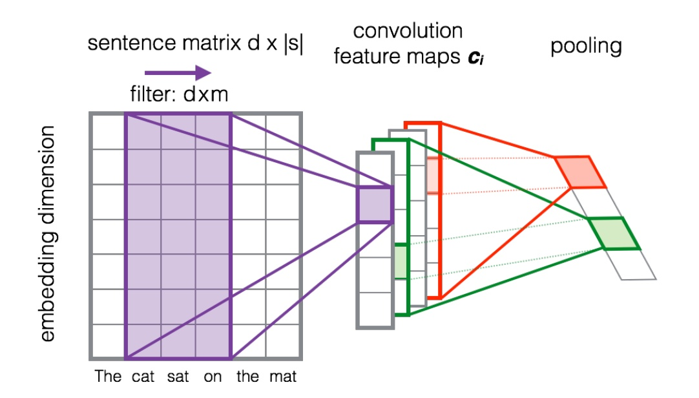
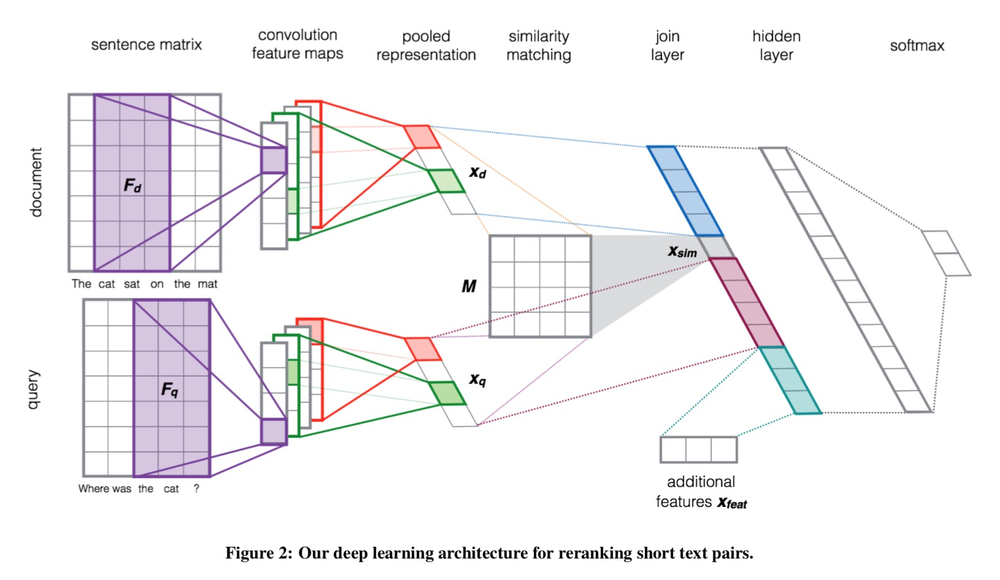

# Web Data Mining Project Report

## 基本信息

### 代码仓库

本小组的Project已经开源至Github，所有代码确系本小组独立完成。

Repo链接为：https://github.com/TACJu/Document-Based-Question-Answering-System

### 小组分工

| 成员 | 分工 |
| ---- | ---- |
|      |      |
|      |      |
|      |      |
|      |      |

### 编译运行环境

Python 3.6

Keras 2.2.4

TensorFlow 1.12.0

## 系统架构

### 生成训练集

#### 词向量训练
从[Wikipedia. org](https://zh.wikipedia.org/wiki/Wikipedia:首页)上下载所有的中文条目，使用jieba包进行分词。之后再调用gensim的Word2Vec进行词向量训练，词向量大小设置为300维。

为了验证利用中文Wiki进行训练的优势，我们之后又在数据文本上进行词向量训练，发现使用中文Wiki的MRR会高3%左右。

#### 数据预处理
对于原始中文文档，使用jieba包进行分词，同时忽略所有的标点符号。

利用之前训练得到的词向量，构建针对于训练文本的词向量层。具体的做法为训练文本中出现的所有单词分配一个id，同时查找该单词对应的词向量，存入一个新的矩阵。这个矩阵就是之后构建的词向量层，每个单词的id就是在这个单词在词向量层中对应的词向量的索引。

#### 训练集生成
根据数据预处理中得到的词向量矩阵，为每一个单词分配的id，将原始文档中的所有单词转化成对应的id。

为每一个句子设置阶段长度为200，统一大小从而方便之后的训练。

利用numpy，分别将经过上述处理的问题 *Query* 和文档 *Document* 每个句子的id序列存入.npy文件，完成训练集和测试集的生成。

### 训练模型

利用以TensorFlow作为后端的Keras生成网络模型。模型输入为问题和文档的句子id序列`[X_train_Q, X_train_A]`，经过词嵌入层 *Embedding* 的处理之后，转化为300维的词向量。

### 输出结果

## 网络模型

我们分别复现了3篇论文中的模型，并且加上了一些自己的修改。

### NaÏve CNN

### CNN(RSTP)

这个模型结构参考的是Learning to rank short text pairs with convolutional deep neural networks。首先使用一个典型的CNN结构对整个句子的词向量矩阵进行处理，首先使用宽度为m的窗口进行一维宽卷积，进行宽卷积能够让句子首尾的词被访问的频率增加。然后将卷积之后的feature map池化为一维向量。

本模型使用上述的CNN结构对问题和文档进行相同的处理，得到两个向量$x_d,x_q$。然后计算这两个向量的相似度$x_{sim} = x_d^TMx_q$，M是一个由网络学习得到的参数矩阵。将$x_d,x_{sim},x_q$与额外的特征合并为一个向量作为最后全连接层的输入。

我们认为这个简单粗暴的模型有效的原因是：它没有直接计算query和document之间的余弦距离，而是多用了一个参数矩阵M。这种计算相似度的方式可以看作是将$x_d$映射成为$x_d^T=Mx_d$，再让$x_d,x_q$之间计算相似度。

后来的一些模型也借鉴了这个经典的结构

一种可能的改进是：对于query和document建模是分开的，但现在很多模型采用共享结构的方式，因为共享之后，可以更好地模拟出query与document之间的一些共有特征，效果可能会更好一些。

### ABCNN

### LSTM with Attention

### 验证集上的性能

| 模型                | 参数 | MAP  | MRR  | 代码(code/)          | 参考文献                                                     |
| ------------------- | ---- | ---- | ---- | -------------------- | ------------------------------------------------------------ |
| naïve CNN           |      |      |      | cnn.py               |                                                              |
| CNN(RSTP)           |      |      |      | rstp.py              | Learning to rank short text pairs with convolutional deep neural networks^[1]^ |
| ABCNN               |      |      |      | abcnn.py/abcnn_v2.py | ABCNN: Attention-based convolutional neural network for modeling sentence pairs^[2]^ |
| LSTM with Attention |      |      |      |                      | Hierarchical attention networks for document classification^[3]^ |
| Combined Model      |      |      |      |                      |                                                              |
|                     |      |      |      |                      |                                                              |
|                     |      |      |      |                      |                                                              |
|                     |      |      |      |                      |                                                              |
|                     |      |      |      |                      |                                                              |

## 参考文献

[1] Severyn, Aliaksei, and Alessandro Moschitti. "Learning to rank short text pairs with convolutional deep neural networks." *Proceedings of the 38th international ACM SIGIR conference on research and development in information retrieval*. ACM, 2015.

[2] Yin, Wenpeng, et al. "ABCNN: Attention-based convolutional neural network for modeling sentence pairs." *arXiv preprint arXiv:1512.05193* (2015).

[3] Yang, Zichao, et al. "Hierarchical attention networks for document classification." *Proceedings of the 2016 Conference of the North American Chapter of the Association for Computational Linguistics: Human Language Technologies*. 2016.